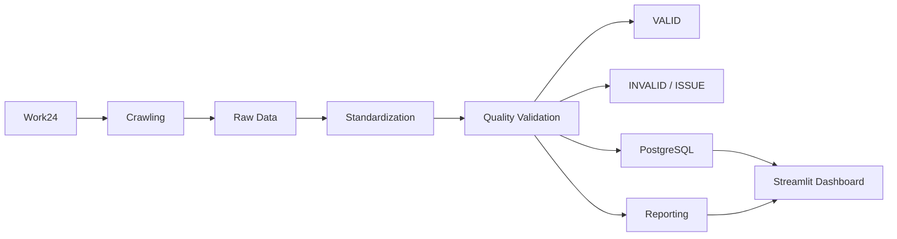

# Work24 강남구 채용공고 데이터 파이프라인

고용24(Work24)의 **서울 강남구 채용공고**를 수집한 뒤,  
**표준화 → 품질검증 → 리포팅 → PostgreSQL 적재 → Streamlit 시각화**까지 연결한 데이터 파이프라인 프로젝트입니다.

단순히 크롤링 결과를 화면에 출력하는 데 그치지 않고,  
수집한 데이터를 분석 가능한 형태로 정제하고 품질 규칙을 적용한 뒤  
검증된 데이터를 데이터베이스와 대시보드에서 활용하도록 구성했습니다.

---

## 1. 프로젝트 개요

### 데이터 수집 조건

| 항목 | 조건 |
|---|---|
| 지역 | 서울 강남구 |
| 연봉 | 3,000만원 이상 ~ 10,000만원 이하 |
| 등록일 | 2026-07-25 ~ 2026-08-07 |
| 마감일 | 2026-08-07 ~ 2026-09-06 |

고용24에서 위 조건으로 조회된 채용공고를 대상으로 크롤링을 수행했습니다.

### 실행 결과

| 항목 | 결과 |
|---|---:|
| 수집 공고 | 257건 |
| 채용 기업 | 207개 |
| 표준화 데이터 | 257건 |
| VALID | 257건 |
| INVALID | 0건 |
| ISSUE | 0건 |
| 품질률 | 100% |

> 품질률 100%는 **정의한 품질 규칙을 모든 데이터가 통과했다는 의미**입니다.  
> 선택 컬럼의 결측값은 별도의 결측치 리포트에서 확인할 수 있습니다.

---

## 2. 데이터 파이프라인



전체 실행 흐름은 `run_full_pipeline.py`에서 시작되며,  
`src/pipeline.py`가 각 처리 단계를 순서대로 연결합니다.

---

## 3. 주요 모듈 구성

| 파일 | 역할 |
|---|---|
| `src/crawler.py` | 고용24 채용공고 수집 및 Raw 데이터 생성 |
| `src/standardizer.py` | 텍스트·날짜·연봉 등 데이터 형식 표준화 |
| `src/quality_checker.py` | 필수값·중복·연봉 범위 등 품질 규칙 검증 |
| `src/models.py` | 파이프라인 공통 데이터 구조 및 결과 객체 정의 |
| `src/reporting.py` | 품질검증 결과 집계 및 CSV/JSON 리포트 생성 |
| `src/database.py` | PostgreSQL 스키마·테이블 생성 및 단계별 데이터 적재 |
| `src/pipeline.py` | 전체 처리 단계 오케스트레이션 |
| `run_full_pipeline.py` | 전체 파이프라인 실행 진입점 |
| `streamlit/backend.py` | PostgreSQL 및 리포트 데이터 조회·필터링·집계 |
| `streamlit/app.py` | 채용 현황·검색·분석·품질 결과 시각화 |

---

## 4. Raw Data

크롤링 결과는 `job_information.csv`에 저장되며,  
총 **257건 × 11개 컬럼**으로 구성됩니다.

| 컬럼 | 설명 |
|---|---|
| `position_title` | 채용공고명 |
| `company_name` | 기업명 |
| `company_category` | 기업 분류 |
| `recruit_provider` | 채용정보 제공처 |
| `annual_salary` | 원본 연봉 문자열 |
| `career` | 경력 조건 |
| `education` | 학력 조건 |
| `working_condition` | 근무조건 |
| `location` | 근무지역 |
| `deadline_date` | 마감일 |
| `registration_date` | 등록일 |

Raw 데이터는 이후 표준화 및 품질검증 단계의 입력 데이터로 사용됩니다.

---

## 5. 데이터 표준화

`src/standardizer.py`에서 수집 데이터를 분석 가능한 형태로 변환합니다.

### 주요 처리

- 텍스트 컬럼 공백 정리
- `company_category` 값 정규화
- 등록일·마감일을 `datetime` 형식으로 변환
- 연봉 문자열에서 최소/최대 연봉 추출
- 공고별 대표 연봉(`annual_salary_avg`) 계산
- 원본 행 추적을 위한 `source_row_number` 생성
- 표준화 시각을 기록하는 `standardized_at` 생성

### 연봉 표준화 예시

```text
Raw
"연봉 3,000만원 ~ 4,500만원"

        ↓

min_annual_salary = 3000
max_annual_salary = 4500
annual_salary_avg = 3750
```

문자열 형태의 연봉 정보를 수치형 컬럼으로 분리하여  
검색 필터, KPI 계산, Box Plot 분석 등에 활용할 수 있도록 했습니다.

---

## 6. 데이터 품질검증

품질검증은 `src/quality_checker.py`에서 수행합니다.

### 6.1 필수값 검증

`config/quality_rules.json`에서 필수 필드를 관리합니다.

- 채용공고명
- 기업명
- 정보제공처
- 지역
- 마감일
- 등록일
- 연봉

### 6.2 추가 품질 규칙

- **기업명 + 채용공고명 기준 중복 검사**
- **최소 연봉 > 최대 연봉 여부 검사**
- **연봉 숫자 변환 실패 검사**

검증 결과는 다음 데이터셋으로 분리됩니다.

- `valid_df`: 모든 품질 규칙을 통과한 데이터
- `invalid_df`: 하나 이상의 품질 오류가 있는 데이터
- `issue_detail_df`: 행별 품질 오류 상세
- `row_result_df`: 각 행의 최종 품질 상태

---

## 7. 품질 리포팅

`src/reporting.py`에서 표준화 데이터와 품질검증 결과를 집계합니다.

생성되는 주요 리포트:

```text
reports/
├── quality_report.json
├── quality_rule_summary.csv
├── missing_value_summary.csv
├── quality_by_location.csv
└── quality_by_education.csv
```

### 주요 지표

- 전체 데이터 수
- VALID / INVALID 데이터 수
- 전체 ISSUE 발생 건수
- 품질률
- 품질 규칙별 오류 건수
- 컬럼별 결측값 현황
- 지역별 품질 현황
- 학력별 품질 현황

---

## 8. PostgreSQL 데이터베이스

### Database / Schema

```text
Database : work24_recruit_database
Schema   : work24_recruit_schema
```

### 테이블 구성

| 테이블 | 역할 |
|---|---|
| `recruit` | 최종 채용공고 서비스용 테이블 |
| `recruit_raw` | 크롤링 원천 데이터 |
| `recruit_standardized` | 표준화 데이터 |
| `recruit_valid` | 품질 규칙 통과 데이터 |
| `recruit_rejected` | 품질 규칙 위반 데이터 |
| `recruit_issue` | 행별 품질 규칙 위반 상세 |
| `recruit_pipeline_run_history` | 파이프라인 실행 및 단계별 처리 건수 기록 |

최종 서비스용 `recruit` 테이블에는  
**품질검증을 통과한 VALID 데이터**를 적재합니다.

> 현재 구현에서는 파이프라인 실행 시 `work24_recruit_schema`를 다시 생성합니다.  
> 따라서 `recruit_pipeline_run_history`는 장기 누적 이력 저장 구조가 아니라  
> 현재 실행의 처리 결과를 기록하는 용도로 사용됩니다.

---

## 9. Streamlit Dashboard

Streamlit은 최종 채용 데이터와 품질 리포트를 사용자에게 보여주는 활용 단계입니다.

### 📊 채용 현황

- 전체 채용공고 수
- 채용 기업 수
- 평균 제시 연봉
- 7일 이내 마감 공고
- 채용공고 미리보기

### 🔍 채용공고 검색

- 기업명 / 공고명 검색
- 채용정보 제공처 필터
- 경력 필터
- 학력 필터
- 연봉 범위 필터
- 마감일 범위 필터
- 검색 결과 CSV 다운로드

### 📈 채용시장 분석

- 연봉 Box Plot
- 경력 조건 분포
- 학력 조건 분포
- 채용정보 제공처 분포

### ✅ 데이터 품질

- 전체 / 정상 / 오류 데이터 수
- 품질률
- 품질 규칙별 오류 현황
- 컬럼별 결측치 현황

### 데이터 소스

```text
채용 현황
채용공고 검색
채용시장 분석
        ↓
PostgreSQL work24_recruit_schema.recruit

데이터 품질
        ↓
reports/ 품질 리포트
```

---

## 10. 프로젝트 구조

```text
work24-recruit-pipeline/
├── config/
│   ├── .env.example
│   ├── database_structure.json
│   └── quality_rules.json
│
├── data/
│   └── raw/
│       └── job_information.csv
│
├── output/
│   ├── standardized/
│   │   └── job_information_standardized.csv
│   └── quality/
│       ├── job_information_quality_result.csv
│       ├── job_information_valid.csv
│       ├── job_information_invalid.csv
│       └── quality_issue_detail.csv
│
├── reports/
│   ├── quality_report.json
│   ├── quality_rule_summary.csv
│   ├── missing_value_summary.csv
│   ├── quality_by_location.csv
│   └── quality_by_education.csv
│
├── sql/
│   ├── 01_create_database.sql
│   └── verification_queries.sql
│
├── src/
│   ├── config_loader.py
│   ├── crawler.py
│   ├── database.py
│   ├── models.py
│   ├── pipeline.py
│   ├── quality_checker.py
│   ├── reporting.py
│   └── standardizer.py
│
├── streamlit/
│   ├── app.py
│   └── backend.py
│
├── .streamlit/
│   └── config.toml
│
├── requirements.txt
└── run_full_pipeline.py
```

`data/raw/`, `output/`, `reports/`의 실행 산출물과 `config/.env`는 `.gitignore`를 통해 Git 추적에서 제외됩니다.

---

## 11. 기술 스택

### Data Processing

- Python
- Pandas
- BeautifulSoup4
- Requests

### Database

- PostgreSQL
- SQLAlchemy
- psycopg

### Visualization

- Streamlit
- Plotly

### Configuration

- python-dotenv
- JSON

---

## 12. 실행 방법

### 12.1 저장소 Clone

```bash
git clone https://github.com/skkuls-bestengineers-team1/work24-recruit-pipeline.git
cd work24-recruit-pipeline
```

### 12.2 패키지 설치

```bash
python3 -m pip install -r requirements.txt
```

### 12.3 환경변수 설정

```bash
cp config/.env.example config/.env
```

`config/.env`에 PostgreSQL 환경을 입력합니다.

```env
PGHOST=127.0.0.1
PGPORT=5432

PGADMINDATABASE=postgres
PGDATABASE=work24_recruit_database

PGUSER=postgres
PGPASSWORD=YOUR_PASSWORD

PGSCHEMA=work24_recruit_schema

SQLALCHEMY_ECHO=false
PGAUTHOR=YOUR_NAME
```

> `config/.env`는 Git에 커밋하지 않습니다.

### 12.4 전체 파이프라인 실행

크롤링부터 PostgreSQL 적재까지 전체 실행:

```bash
python3 run_full_pipeline.py
```

기존 Raw CSV를 사용하여 크롤링만 생략:

```bash
python3 run_full_pipeline.py --skip-crawl
```

### 12.5 Streamlit 실행

```bash
python3 -m streamlit run streamlit/app.py
```

---

## 13. DB 적재 결과 확인

```sql
SELECT 'schema' AS target, COUNT(*) AS count
FROM information_schema.schemata
WHERE schema_name = 'work24_recruit_schema'

UNION ALL

SELECT 'recruit', COUNT(*)
FROM work24_recruit_schema.recruit

UNION ALL

SELECT 'recruit_issue', COUNT(*)
FROM work24_recruit_schema.recruit_issue

UNION ALL

SELECT 'recruit_pipeline_run_history', COUNT(*)
FROM work24_recruit_schema.recruit_pipeline_run_history

UNION ALL

SELECT 'recruit_raw', COUNT(*)
FROM work24_recruit_schema.recruit_raw

UNION ALL

SELECT 'recruit_standardized', COUNT(*)
FROM work24_recruit_schema.recruit_standardized

UNION ALL

SELECT 'recruit_valid', COUNT(*)
FROM work24_recruit_schema.recruit_valid

UNION ALL

SELECT 'recruit_rejected', COUNT(*)
FROM work24_recruit_schema.recruit_rejected;
```

현재 데이터 기준:

```text
schema                        1
recruit                     257
recruit_issue                 0
recruit_pipeline_run_history  1
recruit_raw                 257
recruit_standardized        257
recruit_valid               257
recruit_rejected              0
```

---

## 14. 프로젝트 핵심

> **크롤링 데이터를 바로 사용하는 것이 아니라,  
> 표준화와 품질검증을 거쳐 신뢰 가능한 데이터만 DB와 서비스에서 활용하는 구조를 구현했습니다.**

```text
수집 → 표준화 → 품질검증 → 리포팅 → DB 적재 → 시각화
```

단계별 데이터와 산출물을 분리하여  
각 처리 과정의 역할과 결과를 확인할 수 있도록 구성했습니다.
